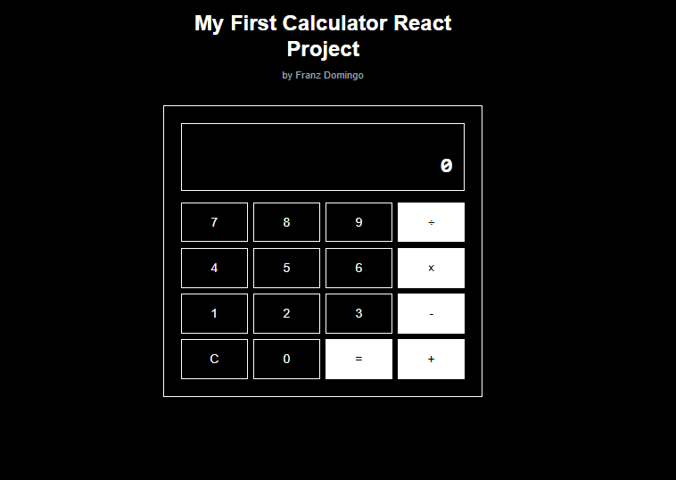

# React Calculator

A modern, accessible calculator built with Next.js, React, and TypeScript. Features dark mode support and full keyboard navigation.



## Features

- 🎨 Clean, modern UI with dark mode support
- ⌨️ Full keyboard navigation
- 🔢 Basic arithmetic operations
- 📱 Responsive design
- ♿ Accessibility features
- 🌙 Automatic dark mode detection

## Tech Stack

- [Next.js](https://nextjs.org/) - React framework
- [React](https://reactjs.org/) - UI library
- [TypeScript](https://www.typescriptlang.org/) - Type safety
- [Tailwind CSS](https://tailwindcss.com/) - Styling
- [Geist Font](https://vercel.com/font) - Typography

## Getting Started

### Prerequisites

- Node.js 18+ 
- npm or yarn

### Installation

1. Clone the repository:
```bash
git clone https://github.com/yourusername/react-calculator.git
cd react-calculator
```

2. Install dependencies:
```bash
npm install
# or
yarn install
```

3. Start the development server:
```bash
npm run dev
# or
yarn dev
```

4. Open [http://localhost:3000](http://localhost:3000) in your browser

## Usage

### Basic Operations

- Addition (+)
- Subtraction (-)
- Multiplication (×)
- Division (÷)
- Clear (C)
- Equals (=)

### Keyboard Shortcuts

- Numbers: `0-9`
- Operations: `+`, `-`, `*`, `/`
- Calculate: `Enter` or `=`
- Clear: `Escape`

## Project Structure

```
src/
├── app/
│   ├── layout.tsx    # Root layout with font configuration
│   ├── page.tsx      # Main calculator page
│   └── globals.css   # Global styles and theme variables
├── components/
│   ├── Calculator.tsx # Main calculator logic
│   ├── Display.tsx   # Calculator display component
│   ├── Keypad.tsx    # Calculator keypad layout
│   └── Button.tsx    # Reusable button component
```

## Contributing

Contributions are welcome! Please feel free to submit a Pull Request.

1. Fork the project
2. Create your feature branch (`git checkout -b feature/AmazingFeature`)
3. Commit your changes (`git commit -m 'Add some AmazingFeature'`)
4. Push to the branch (`git push origin feature/AmazingFeature`)
5. Open a Pull Request

## Development

### Available Scripts

- `npm run dev` - Start development server
- `npm run build` - Build for production
- `npm run start` - Start production server
- `npm run lint` - Run ESLint

### Code Style

This project uses:
- ESLint for code linting
- Prettier for code formatting
- TypeScript for type checking

## License

This project is licensed under the MIT License - see the [LICENSE](LICENSE) file for details.

## Acknowledgments

- Design inspired by modern calculator interfaces
- Built with accessibility in mind
- Font provided by [Vercel](https://vercel.com/font)

## Contact

Name - Franz Phillip G. Domingo
Email: 
- Orstedfinance@gmail.com
- Orstedfinance@icloud.com
- 202110383@fit.edu.ph


